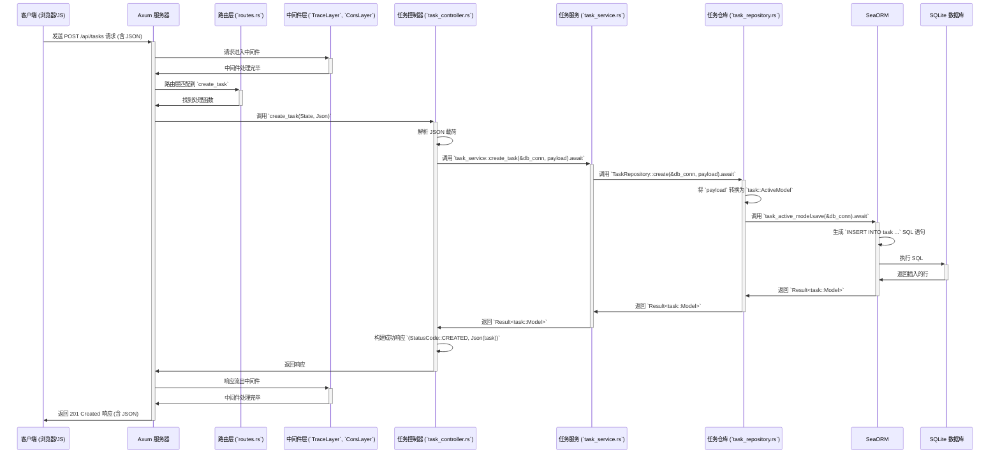

# Axum 分层架构学习项目

## 项目介绍

这是一个为 Rust 初学者设计的 Axum 框架学习项目。本项目实现了一个简单的任务管理系统 (Task Management) API，采用分层架构设计，旨在帮助你理解如何组织大型应用程序。

**项目亮点:**

- ✨ **现代 Rust Web 开发**: 基于 Axum 0.7+ 和 Tokio 构建。
- 📚 **学习友好**: 包含极其详尽的中文注释和模块级文档，解释了每个部分的作用和 Rust 的关键概念。
- 🏗️ **清晰的分层架构**: 采用 **控制器 (Controller) - 服务 (Service) - 仓库 (Repository)** 模式，实现关注点分离。
- 🗃️ **持久化存储**: 使用 **SeaORM** 与 **SQLite** 数据库，并包含自动化的数据库迁移。
- 📝 **完整的 CRUD API**: 实现了任务的增、删、改、查操作。
- 🌐 **WebSocket 实时通信**: 包含 WebSocket 端点示例，用于实时交互。
- ⚙️ **配置管理**: 从环境变量加载配置。
- 📝 **日志记录**: 集成了 `tracing` 和 `tower_http` 的日志中间件。
- 🛡️ **错误处理**: 统一的 `AppError` 类型和 `IntoResponse` 实现。
- 📄 **静态文件服务**: 使用 `ServeDir` 提供静态资源 (HTML, CSS)。

## 技术栈示意图

```mermaid
graph TD
    subgraph "客户端 (Client)"
        C1[浏览器/HTTP 客户端 (Client)] -->|HTTP/1.1, WebSocket| S(Axum 服务器)
    end

    subgraph "服务器 (Server - Axum 应用)"
        S --> R(路由层 - `routes.rs`);
        R --> M(中间件层 - `middleware/`)
        M --> CTRL(控制器层 - `controller/`);
        CTRL --> SRV(服务层 - `service/`);
        SRV --> REPO(仓库层 - `repository/`);
        REPO --> ORM(SeaORM);
        ORM -->|SQL| DB[SQLite 数据库];
        
        subgraph "支持模块"
            CONF(配置 - `config.rs`) --> S;
            ERR(错误处理 - `error.rs`) --> CTRL;
            ERR --> SRV;
            MOD(模型/实体 - `model/` & `entity/`) --> REPO;
            MOD --> SRV;
            LOG(日志 - `tracing` 框架) --> S;
            LOG --> M;
        end
        
        S --> START(启动与初始化 - `startup.rs`);
        START --> R;
        START --> M;
        START --> DB;
        START --> LOG;
        START --> CONF;
        S --> MAIN(入口文件 - `main.rs`);
        MAIN --> START;
    end

```

## 项目进展跟踪

### ✅ 已完成的功能 (Completed Features)
- [x] **基础架构**: 搭建了 Controller-Service-Repository 的分层架构。
- [x] **数据库集成**: **项目已从内存存储迁移到由 SeaORM 管理的 SQLite 持久化数据库。**
- [x] **核心 API**: 实现了任务 (Task) 的完整 CRUD (增删改查) 功能。
- [x] **实时通信**: 添加了 WebSocket 实时交互端点。
- [x] **配置管理**: 实现了从环境变量加载应用配置。
- [x] **日志系统**: 集成了 `tracing` 用于结构化日志和请求跟踪。
- [x] **错误处理**: 定义了统一的 `AppError` 类型进行错误管理。
- [x] **静态服务**: 配置了静态文件（HTML/CSS/JS）的托管。
- [x] **技术升级**: **项目已从 Rust 2021 Edition 迁移至 2024 Edition。**

### 🚧 正在进行的工作 (Work in Progress)
- 暂无

### 🚀 未来规划 (Future Plans)
- [ ] **用户认证**: 添加用户注册、登录功能，并使用 JWT (JSON Web Tokens) 进行 API 认证。
- [ ] **输入验证**: 为 API 请求体 (Payload) 添加输入验证逻辑 (例如使用 `validator` crate)。
- [ ] **单元与集成测试**: 为 Service 层和 Controller 层编写全面的单元测试和集成测试。
- [ ] **容器化**: 为项目编写 `Dockerfile` 以便容器化部署。
- [ ] **高级查询**: 实现更复杂的查询功能，如分页、排序和过滤。

## 目录结构说明

下表详细说明了项目源代码 (`src/`) 目录下的文件和文件夹及其作用：

| 路径 (`src/`)        | 类型   | 核心职责                                                     | 关键技术/概念                                      |
| :------------------- | :----- | :----------------------------------------------------------- | :------------------------------------------------- |
| `main.rs`            | 文件   | **应用入口**：启动服务器，初始化异步运行时。                   | `#[tokio::main]`, `axum::serve`, 模块声明 (`mod`)    |
| `startup.rs`         | 文件   | **启动与初始化**：组装应用，配置日志、数据库连接、路由、中间件。 | `Router`, `ServiceBuilder`, `Layer`, `AppState`, `Database::connect` |
| `config.rs`          | 文件   | **配置管理**：定义 `AppConfig`，从环境变量加载配置。       | `struct`, `impl`, `std::env::var`, `.parse()`    |
| `error.rs`           | 文件   | **错误处理**：定义 `AppError` 枚举，实现 `IntoResponse`。      | `enum`, `impl IntoResponse`, `Result` 类型别名    |
| `routes.rs`          | 文件   | **路由定义**：将 URL 路径和 HTTP 方法映射到控制器函数。        | `Router::new()`, `.route()`, `.nest()`, `.merge()` |
| `migration/`         | 目录   | **数据库迁移**：包含 `sea-orm-cli` 生成的数据库版本控制脚本。 | `sea-orm-cli`, `MigratorTrait`, `async-std::main` |
| `app/`               | 目录   | **核心应用逻辑根目录**                                         | -                                                  |
| `app/mod.rs`         | 文件   | 声明 `app` 下的子模块 (`controller`, `service`, etc.)。        | `pub mod`                                          |
| `app/controller/`    | 目录   | **控制器层 (Controller)**：处理 HTTP 请求，调用服务层。      | HTTP 交互, 参数提取, 响应构建                       |
| `app/controller/task_controller.rs` | 文件 | 实现 `/tasks` 相关 API 的处理函数。                            | `axum::extract`, `Json`, `Path`, `State`, `.await` |
| `app/service/`       | 目录   | **服务层 (Service)**：实现核心业务逻辑，调用仓库层。     | 业务规则, 数据协调, 事务管理 (如果需要)           |
| `app/service/task_service.rs` | 文件 | 实现任务相关的业务操作函数。                                 | `async fn`, 依赖注入 (参数传递 `&DatabaseConnection`)            |
| `app/repository/`    | 目录   | **仓库层 (Repository)**：封装数据访问逻辑，与数据库直接交互。 | `SeaORM`, `ActiveModelTrait`, `EntityTrait`, `DatabaseConnection` |
| `app/repository/task_repository.rs` | 文件 | 实现任务相关的数据库 CRUD 操作。 | `Task::find_by_id()`, `Task::find()`, `save()`, `delete()` |
| `app/model/`         | 目录   | **模型层 (Model)**：定义数据传输对象 (DTO) 和请求载荷。                 | `serde::{Serialize, Deserialize}`, `struct` |
| `app/model/task.rs`  | 文件   | 定义 `CreateTaskPayload`, `UpdateTaskPayload` 等。 | `struct`, `Uuid`, `serde` |
| `app/entity/`        | 目录   | **实体层 (Entity)**：定义数据库表对应的 `SeaORM` 实体。 | `#[derive(Clone, PartialEq, Eq, DeriveEntityModel)]` |
| `app/entity/task.rs` | 文件   | 定义 `task` 表的 `SeaORM` 实体 (`entity::task::Entity`)。 | `EntityTrait`, `ActiveModelBehavior` |
| `app/middleware/`    | 目录   | **中间件层 (Middleware)**：提供可重用的横切关注点逻辑。        | 日志, CORS, (可选) 认证/授权等                  |
| `static/`            | 目录   | **静态资源**：存放前端 HTML, CSS, JS 等文件。                | -                                                  |
| `static/index.html`  | 文件   | 用于测试 API 和 WebSocket 的简单前端页面。                   | HTML, JavaScript (Fetch API, WebSocket API)      |

## 本地运行流程

```mermaid
flowchart LR
    subgraph "准备阶段"
        A[克隆项目: `git clone ...`] --> B[进入目录: `cd axum-tutorial`];
        B --> C{安装 `sea-orm-cli` (如果未安装): `cargo install sea-orm-cli`};
        C --> D[构建项目 (下载依赖): `cargo build` 命令];
    end

    subgraph "运行阶段"
        D --> E{运行服务器: `cargo run` 命令};
        E -- 首次运行或模型变更 --> F[自动创建 `db.sqlite` 并应用迁移];
        F --> G[服务器在 http://localhost:3000 (HTTP/1.1) 启动];
        G --> H[打开浏览器访问 http://localhost:3000];
        H --> I[使用前端页面测试 API 或 WebSocket];
    end

    subgraph "测试 API (示例)"
        J[使用 Postman/curl 等工具]
        J --> K[发送 POST (提交) 请求到 /api/tasks 创建任务];
        J --> L[发送 GET (获取) 请求到 /api/tasks 获取任务列表];
    end
```

## 前后端交互流程 (创建任务示例)



## 安装与设置

### 前提条件

- Rust 和 Cargo (建议使用 [rustup](https.rustup.rs/) 安装)
- `sea-orm-cli` 用于数据库迁移管理。如果未安装，请运行:
  ```bash
  cargo install sea-orm-cli
  ```
- 基本的命令行知识

### 依赖安装

项目依赖已在 `Cargo.toml` 中定义，运行以下命令安装：

```bash
cargo build
```

## 数据库迁移

本项目使用 `sea-orm-cli` 管理数据库 schema 的变更。

- **迁移文件位置**: `migration/src/`
- **自动迁移**: 应用启动时 (`cargo run`) 会自动检查并运行所有尚未应用的迁移。
- **手动创建迁移**: 当你修改了 `app/entity/` 中的实体后，可以运行以下命令创建一个新的迁移文件：
  ```bash
  sea-orm-cli migrate generate <migration_name>
  ```
  然后你需要编辑新生成的迁移文件来实现具体的 schema 变更。

## 运行方式

### 启动服务器

```bash
cargo run
```

服务器默认在 `http://localhost:3000` 启动，并会自动创建和迁移位于项目根目录的 `db.sqlite` 文件。

你可以通过设置 `.env` 文件或环境变量来修改配置。

## API 使用指南

API 路由都挂载在 `/api` 前缀下。

### 任务管理 API

#### 创建任务
```http
POST /api/tasks
Content-Type: application/json

{
  "title": "学习 SeaORM",
  "description": "理解 ActiveModel 和 Entity"
}
```

#### 获取所有任务
```http
GET /api/tasks
```

#### 获取单个任务
```http
GET /api/tasks/:id
```
**示例**: `GET /api/tasks/xxxxxxxx-xxxx-xxxx-xxxx-xxxxxxxxxxxx`

#### 更新任务
```http
PUT /api/tasks/:id
Content-Type: application/json

{
  "title": "学习 SeaORM (已更新)",
  "description": "已完成 ActiveModel 和 Entity 的学习",
  "completed": true
}
```

#### 删除任务
```http
DELETE /api/tasks/:id
```

### WebSocket

连接端点: `ws://localhost:3000/ws`

- 连接后，服务器会定期发送 Ping 消息。
- 客户端可以发送任何文本消息，服务器会将其广播给所有连接的客户端。

## 学习建议

1.  **理解分层结构**: 先看懂 `README.md` 中的【技术栈示意图】和【目录结构说明】，理解各层职责和依赖关系。
2.  **跟踪请求流程**: 阅读【前后端交互流程 (创建任务示例)】图，了解一个请求是如何从客户端流经服务器各层，最终返回响应的。
3.  **阅读源码与注释**: 从 `main.rs` 和 `startup.rs` 开始，按照代码执行流程阅读。重点关注每个模块的 `.rs` 文件顶部的注释块。
4.  **理解 SeaORM**:
    *   **Entity (`app/entity/`)**: 定义了如何将 Rust 结构体映射到数据库表。
    *   **ActiveModel**: 用于创建和更新操作，代表一个可变的、待保存到数据库的实体。
    *   **Repository (`app/repository/`)**: 学习如何使用 `EntityTrait` 和 `ActiveModelTrait` 来执行具体的数据库查询。
5.  **运行与调试**: 运行项目 (`cargo run`)，使用浏览器或 Postman 等工具实际调用 API，观察控制台输出的日志，加深理解。
6.  **动手实践**: 尝试修改代码或添加新功能：
    *   为 `Task` 实体添加一个截止日期 (`due_date: Option<DateTime<Utc>>`) 字段，然后创建一个新的数据库迁移并更新所有 CRUD 操作。
    *   添加一个新的 API 端点，例如 `/api/tasks/search?q=...` 用于根据标题或描述搜索任务。
    *   为 WebSocket 添加更复杂的功能，如房间或用户认证。

## 许可证

MIT 