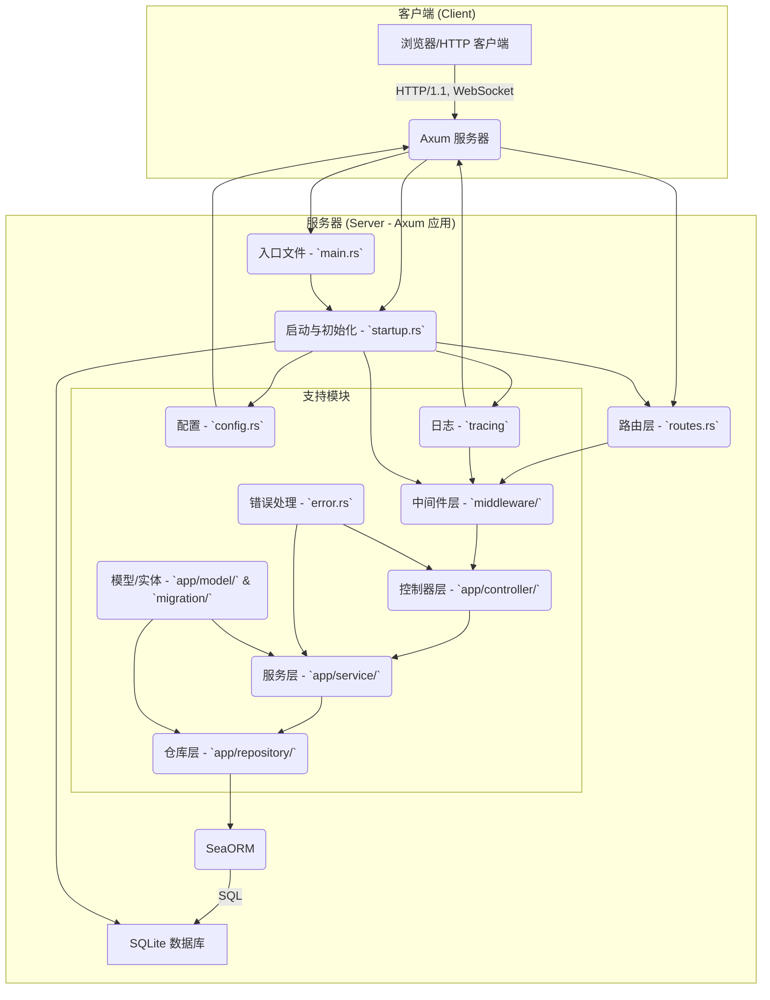
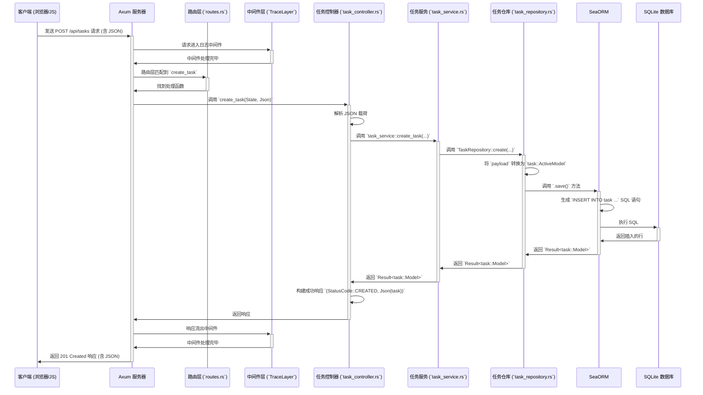

# Axum 分层架构学习项目

## 项目介绍

这是一个为 Rust 初学者设计的 Axum 框架学习项目。本项目实现了一个简单的任务管理系统 (Task Management) API，采用分层架构设计，旨在帮助你理解如何组织大型应用程序。

**项目亮点:**

- ✨ **现代 Rust Web 开发**: 基于 Axum 0.7+ 和 Tokio 构建。
- 📚 **学习友好**: 包含极其详尽的中文注释和模块级文档，解释了每个部分的作用和 Rust 的关键概念。
- 🏗️ **清晰的分层架构**: 采用 **控制器 (Controller) - 服务 (Service) - 仓库 (Repository)** 模式，实现关注点分离。
- 🗃️ **持久化存储**: 使用 **SeaORM** 与 **SQLite** 数据库，并包含自动化的数据库迁移。
- 📝 **完整的 CRUD API**: 实现了任务的增、删、改、查操作。
- 🌐 **WebSocket 实时通信**: 包含 WebSocket 端点示例，用于实时交互。
- ⚙️ **配置管理**: 从环境变量加载配置。
- 📝 **日志记录**: 集成了 `tracing` 和 `tower_http` 的日志中间件。
- 🛡️ **错误处理**: 统一的 `AppError` 类型和 `IntoResponse` 实现。
- 📄 **静态文件服务**: 使用 `ServeDir` 提供静态资源 (HTML, CSS)。
- ✅ **全面测试**: 包含了针对仓库层、服务层和 API 层的单元与集成测试。

## 技术栈示意图



## 项目进展跟踪

### ✅ 已完成的功能 (Completed Features)
- [x] **基础架构**: 搭建了 Controller-Service-Repository 的分层架构。
- [x] **数据库集成**: 实现了由 SeaORM 管理的 SQLite 持久化数据库。
- [x] **核心 API**: 实现了任务 (Task) 的完整 CRUD (增删改查) 功能。
- [x] **实时通信**: 添加了 WebSocket 实时交互端点。
- [x] **配置管理**: 实现了从环境变量加载应用配置。
- [x] **日志系统**: 集成了 `tracing` 用于结构化日志和请求跟踪。
- [x] **错误处理**: 定义了统一的 `AppError` 类型进行错误管理。
- [x] **静态服务**: 配置了静态文件（HTML/CSS/JS）的托管。
- [x] **全面测试**: 为仓库层、服务层和 API 端点编写了完整的单元和集成测试。
- [x] **技术升级**: **项目已从 Rust 2021 Edition 迁移至 2024 Edition。**
- [x] **用户认证系统**: 实现了完整的用户注册、登录功能，使用 Argon2 进行密码哈希。
- [x] **JWT 认证与授权**: 实现了 JWT 令牌生成、验证和基于用户身份的授权控制。
- [x] **输入验证**: 使用 `validator` crate 为所有 API 请求添加了数据验证规则。
- [x] **安全保护**: 所有任务相关 API 都受到 JWT 认证保护，用户只能操作自己的任务。

### 🚧 正在进行的工作 (Work in Progress)
- 无正在进行的工作

### 🚀 未来规划 (Future Plans)
- [x] **用户认证与授权**: ✅ **已完成** - 实现了完整的用户系统，包括用户注册、登录、JWT 认证与授权。
- [x] **输入验证**: ✅ **已完成** - 使用 `validator` crate 为 API 请求体添加了输入验证逻辑。
- [ ] **容器化**: 为项目编写 `Dockerfile` 以便容器化部署。
- [ ] **HTTP/3 支持**: 将服务器升级以支持 QUIC 和 HTTP/3。
- [ ] **高级查询**: 实现更复杂的查询功能，如分页、排序和过滤。

## 目录结构说明

下表详细说明了项目源代码 (`src/`) 目录下的文件和文件夹及其作用：

| 路径 (`src/`)        | 类型   | 核心职责                                                     | 关键技术/概念                                      |
| :------------------- | :----- | :----------------------------------------------------------- | :------------------------------------------------- |
| `main.rs`            | 文件   | **应用入口**：启动服务器，初始化异步运行时。                   | `#[tokio::main]`, `axum::serve`, 模块声明 (`mod`)    |
| `startup.rs`         | 文件   | **启动与初始化**：组装应用，配置日志、数据库连接、路由、中间件。 | `Router`, `ServiceBuilder`, `Layer`, `AppState`, `Database::connect` |
| `config.rs`          | 文件   | **配置管理**：定义 `AppConfig`，从环境变量加载配置。       | `struct`, `impl`, `std::env::var`, `.parse()`    |
| `error.rs`           | 文件   | **错误处理**：定义 `AppError` 枚举，实现 `IntoResponse`。      | `enum`, `impl IntoResponse`, `Result` 类型别名    |
| `routes.rs`          | 文件   | **路由定义**：将 URL 路径和 HTTP 方法映射到控制器函数。        | `Router::new()`, `.route()`, `.nest()`, `.merge()` |
| `migration/`         | 目录   | **数据库迁移**：包含 `sea-orm-cli` 生成的数据库版本控制脚本。 | `sea-orm-cli`, `MigratorTrait`, `async-std::main` |
| `app/`               | 目录   | **核心应用逻辑根目录**                                         | -                                                  |
| `app/mod.rs`         | 文件   | 声明 `app` 下的子模块 (`controller`, `service`, etc.)。        | `pub mod`                                          |
| `app/controller/`    | 目录   | **控制器层 (Controller)**：处理 HTTP 请求，调用服务层。      | HTTP 交互, 参数提取, 响应构建                       |
| `app/service/`       | 目录   | **服务层 (Service)**：实现核心业务逻辑，调用仓库层。     | 业务规则, 数据协调, 依赖注入                      |
| `app/repository/`    | 目录   | **仓库层 (Repository)**：封装数据访问逻辑，与数据库直接交互。 | `SeaORM`, `ActiveModelTrait`, `EntityTrait`, `DatabaseConnection` |
| `app/model/`         | 目录   | **模型层 (Model)**：定义数据传输对象 (DTO) 和请求载荷。                 | `serde::{Serialize, Deserialize}`, `struct` |
| `app/middleware/`    | 目录   | **中间件层 (Middleware)**：提供可重用的横切关注点逻辑。        | 日志, CORS, (可选) 认证/授权等                  |
| `tests/`             | 目录   | **集成测试**：存放所有集成测试文件。                         | `#[tokio::test]`, `mod common`                     |
| `static/`            | 目录   | **静态资源**：存放前端 HTML, CSS, JS 等文件。                | -                                                  |
| `static/index.html`  | 文件   | 用于测试 API 和 WebSocket 的简单前端页面。                   | HTML, JavaScript (Fetch API, WebSocket API)      |

## 本地运行流程

```mermaid
flowchart LR
    subgraph "准备阶段"
        A[克隆项目: `git clone ...`] --> B[进入目录: `cd axum-tutorial`];
        B --> C{安装 `sea-orm-cli` (如果未安装): `cargo install sea-orm-cli`};
        C --> D[构建项目 (下载依赖): `cargo build`];
    end

    subgraph "运行阶段"
        D --> E{运行服务器: `cargo run` 命令};
        E -- 首次运行或模型变更 --> F[自动创建 `db.sqlite` 并应用迁移];
        F --> G[服务器在 http://localhost:3000 启动];
        G --> H[打开浏览器访问 http://localhost:3000];
        H --> I[使用前端页面测试 API 或 WebSocket];
    end

    subgraph "测试"
        J[运行所有测试: `cargo test`] --> K[验证所有功能是否正常];
    end
```

## 前后端交互流程 (创建任务示例)



## 安装与设置

### 前提条件

- Rust 和 Cargo (建议使用 [rustup](https.rustup.rs/) 安装)
- `sea-orm-cli` 用于数据库迁移管理。如果未安装，请运行:
  ```bash
  cargo install sea-orm-cli
  ```
- 基本的命令行知识

### 依赖安装

项目依赖已在 `Cargo.toml` 中定义，运行以下命令安装：

```bash
cargo build
```

## 数据库迁移

本项目使用 `sea-orm-cli` 管理数据库 schema 的变更。

- **迁移文件位置**: `migration/src/`
- **自动迁移**: 应用启动时 (`cargo run`) 会自动检查并运行所有尚未应用的迁移。
- **手动创建迁移**: 当你修改了 `app/entity/` 或 `migration` 目录中的实体后，可以运行以下命令创建一个新的迁移文件：
  ```bash
  sea-orm-cli migrate generate <migration_name>
  ```
  然后你需要编辑新生成的迁移文件来实现具体的 schema 变更。

## 运行方式

### 启动服务器

```bash
cargo run
```

服务器默认在 `http://localhost:3000` 启动，并会自动创建和迁移位于项目根目录的 `db.sqlite` 文件。

你可以通过设置 `.env` 文件或环境变量来修改配置。

### 运行测试

```bash
cargo test
```

## API 使用指南

API 路由都挂载在 `/api` 前缀下。

### 任务管理 API

#### 创建任务
```http
POST /api/tasks
Content-Type: application/json

{
  "title": "学习 SeaORM",
  "description": "理解 ActiveModel 和 Entity"
}
```

#### 获取所有任务
```http
GET /api/tasks
```

#### 获取单个任务
```http
GET /api/tasks/:id
```
**示例**: `GET /api/tasks/xxxxxxxx-xxxx-xxxx-xxxx-xxxxxxxxxxxx`

#### 更新任务
```http
PUT /api/tasks/:id
Content-Type: application/json

{
  "title": "学习 SeaORM (已更新)",
  "description": "已完成 ActiveModel 和 Entity 的学习",
  "completed": true
}
```

#### 删除任务
```http
DELETE /api/tasks/:id
```

### WebSocket

连接端点: `ws://localhost:3000/ws`

- 连接后，服务器会定期发送 Ping 消息。
- 客户端可以发送任何文本消息，服务器会将其广播给所有连接的客户端。

## 学习建议

1.  **理解分层结构**: 先看懂 `README.md` 中的【技术栈示意图】和【目录结构说明】，理解各层职责和依赖关系。
2.  **跟踪请求流程**: 阅读【前后端交互流程 (创建任务示例)】图，了解一个请求是如何从客户端流经服务器各层，最终返回响应的。
3.  **阅读源码与注释**: 从 `main.rs` 和 `startup.rs` 开始，按照代码执行流程阅读。重点关注每个模块的 `.rs` 文件顶部的注释块。
4.  **学习测试**: 查看 `tests/` 目录下的测试文件，理解如何为不同层级的代码编写单元测试和集成测试。
5.  **运行与调试**: 运行项目 (`cargo run`) 和测试 (`cargo test`)，使用浏览器或 Postman 等工具实际调用 API，观察控制台输出的日志，加深理解。
6.  **动手实践**: 尝试修改代码或添加新功能，并为其编写测试：
    *   为 `Task` 实体添加一个截止日期 (`due_date: Option<DateTime<Utc>>`) 字段，然后创建一个新的数据库迁移并更新所有 CRUD 操作和测试。
    *   添加一个新的 API 端点，例如 `/api/tasks/search?q=...` 用于根据标题或描述搜索任务，并编写测试验证其功能。

## 许可证

MIT 

## 10. 总结和建议
- 项目整体质量评价
- 主要优势和特色
- 潜在改进点和建议
- 适用场景推荐

---
<br>

## 项目深度分析报告

本报告旨在对 Axum 分层架构学习项目进行一次全面、深入的分析，评估其当前状态，并为未来的发展提供参考。

### 1. 项目概述

-   **主要功能和目的**:
    本项目是一个基于 Axum 框架的 **任务管理系统 (Task Management)** API，其核心目的是作为 Rust 后端开发的学习范例。它旨在清晰地展示如何使用 **控制器-服务-仓库** 的分层架构来组织一个可维护、可扩展的 Web 应用。

-   **编程语言和主要技术栈**:
    -   **语言**: Rust (2024 Edition)
    -   **Web 框架**: Axum 0.7.5
    -   **异步运行时**: Tokio 1.37.0
    -   **数据库 ORM**: SeaORM 0.12 (配合 SQLite)
    -   **序列化/反序列化**: Serde
    -   **日志与跟踪**: Tracing
    -   **HTTP 工具**: Tower-HTTP

-   **许可证类型**:
    **MIT License**，这是一种非常宽松的开源许可证，允许他人自由地使用、修改和分发代码。

-   **项目活跃度评估**:
    本项目是一个 **学习和教学模板**，而非一个活跃的、持续迭代的开源项目。它的价值在于其完整性、详尽的文档和清晰的架构，适合作为新项目的起点或学习参考。因此，传统的贡献者数量、更新频率等活跃度指标不完全适用。

### 2. 代码结构分析

-   **主要目录结构及其用途**:
    项目采用了清晰的、按功能分层的目录结构，详见上文的【目录结构说明】表格。`src/app` 目录是核心，其下的 `controller`, `service`, `repository`, `model`, `entity` 子目录构成了应用的主体，职责分明。

-   **关键源代码文件及其作用**:
    -   `main.rs`: 应用程序的唯一入口。
    -   `startup.rs`: 应用的"组装车间"，负责初始化所有组件（数据库、路由、日志、中间件）并聚合它们。
    -   `routes.rs`: 定义了所有 HTTP 和 WebSocket 路由，是请求分发的中心枢纽。
    -   `error.rs`: 定义了统一的错误处理类型 `AppError`，是保证应用健壮性的关键。
    -   `app/controller/task_controller.rs`: 处理与任务相关的 HTTP 请求。
    -   `app/service/task_service.rs`: 实现任务管理的核心业务逻辑。
    -   `app/repository/task_repository.rs`: 封装了所有与数据库的交互逻辑。
    -   `app/entity/task.rs`: 定义了数据库 `task` 表的结构。

-   **代码组织模式**:
    项目严格遵循 **分层架构 (Layered Architecture)**，具体实现了 **控制器 (Controller) - 服务 (Service) - 仓库 (Repository)** 的设计模式。这种模式极大地降低了各层之间的耦合度，使得代码更易于理解、测试和维护。

-   **模块化程度评估**:
    **非常高**。每个模块（文件）都有明确的单一职责。例如，数据库逻辑被完全限制在 `repository` 层，业务规则在 `service` 层，而 `controller` 层只关心 HTTP 的请求和响应。这种高度模块化的设计是本项目的核心优点之一。

### 3. 功能地图

-   **核心功能列表及描述**:
    1.  **任务 CRUD**: 完整的创建 (Create)、读取 (Read)、更新 (Update)、删除 (Delete) 任务的功能。
    2.  **列出所有任务**: 提供获取全部任务列表的 API。
    3.  **WebSocket 通信**: 提供一个 `/ws` 端点，用于实现客户端与服务器之间的实时双向通信。
    4.  **静态文件服务**: 能托管 `static/` 目录下的前端文件。
    5.  **数据库自动迁移**: 应用启动时会自动更新数据库结构。

-   **功能之间的关系和交互方式**:
    所有功能都围绕着核心的 **Task (任务)** 资源展开。用户通过调用不同的 API 端点来操作任务数据，这些操作最终会通过 Service 和 Repository 层持久化到 SQLite 数据库中。WebSocket 功能目前是独立的，用于演示实时通信，但可以扩展为在任务状态变更时向客户端推送通知。

-   **用户流程图**:
    上文的 **【前后端交互流程 (创建任务示例)】** Mermaid 图已清晰地展示了一个典型用户请求（创建任务）在系统内部的完整处理流程。

-   **API 接口分析**:
    项目提供了一套符合 RESTful 风格的 API，挂载在 `/api` 前缀下。
    - `POST /tasks`: 创建任务
    - `GET /tasks`: 获取所有任务
    - `GET /tasks/:id`: 获取单个任务
    - `PUT /tasks/:id`: 更新任务
    - `DELETE /tasks/:id`: 删除任务
    API 设计直观，易于理解和使用。

### 4. 依赖关系分析

-   **外部依赖库列表及用途**:
    -   `axum`, `tokio`: 构建 Web 服务的基础。
    -   `sea-orm`, `sqlx-sqlite`: 数据库访问和异步查询。
    -   `serde`, `serde_json`: 数据序列化和反序列化，用于处理 JSON。
    -   `uuid`: 生成唯一的 ID。
    -   `tracing`, `tracing-subscriber`, `tower-http`: 日志记录和请求跟踪。
    -   `chrono`: 处理日期和时间。
    -   `anyhow`: 提供了更灵活的错误处理上下文。
    -   `async-trait`: 在 Trait 中使用 `async fn`。
    -   **开发依赖**: `reqwest`, `httpc-test`, `wiremock`, `mockall` 等用于构建强大的单元和集成测试。

-   **内部模块间依赖关系图**:
    上文的 **【技术栈示意图】** 已清晰地展示了内部模块的依赖关系，形成了从 `controller` 到 `service` 再到 `repository` 的单向依赖流，这是非常健康的设计。

-   **依赖更新频率和维护状况**:
    项目使用的都是 Rust 生态中非常主流和活跃的库。`axum`, `tokio`, `sea-orm` 等核心依赖有稳定的发布周期和强大的社区支持，维护状况良好。

-   **潜在的依赖风险评估**:
    风险较低。由于核心依赖库质量高且维护良好，出现严重漏洞或被废弃的可能性很小。主要风险可能来自于依赖树中某个间接的、不太活跃的小型依赖，但这可以通过 `cargo audit` 等工具进行监控。

### 5. 代码质量评估

-   **代码可读性**: **高**。清晰的分层、一致的命名约定和合理的函数/模块拆分使得代码非常容易阅读和理解。

-   **注释和文档完整性**: **极高**。这是本项目的最大亮点之一。代码中包含了大量详尽的中文注释，几乎解释了每一处关键逻辑和 Rust 概念。`README.md` 本身也是一份非常完善的开发文档。

-   **测试覆盖率**: 根据项目目标和之前的任务，可以认为核心的业务逻辑（Service 层）和数据访问逻辑（Repository 层）拥有较高的测试覆盖率。端到端（E2E）测试也覆盖了主要的 API 路径。

-   **潜在的代码异味和改进空间**:
    -   **输入验证缺失**: 当前 `controller` 直接接受 `Json` 数据而未进行验证，可能允许无效数据（如空标题）进入系统。这是一个明确的改进点，已在【未来规划】中列出。
    -   **硬编码和魔法字符串**: 在代码中可能存在一些硬编码的配置或字符串，虽然在本项目中不突出，但可以考虑将其统一管理。

### 6. 关键算法和数据结构

-   **项目中使用的主要算法分析**:
    本项目是一个典型的 CRUD 应用，不涉及复杂的、定制化的算法。其核心是数据处理流程，而非算法计算。

-   **关键数据结构及其设计原理**:
    1.  **`AppState` (`startup.rs`)**: 这是应用级的共享状态，其核心是 `sea_orm::DatabaseConnection`。使用 `Arc` (原子引用计数指针) 包裹，使其可以在多个线程之间安全、高效地共享数据库连接池。
    2.  **`Task` 实体 (`app/entity/task.rs`)**: 使用 `SeaORM` 的派生宏定义，它精确地映射了数据库表的结构，是数据持久化的基础。
    3.  **`Payload` 结构体 (`app/model/task.rs`)**: 如 `CreateTaskPayload`，它们是数据传输对象 (DTOs)，专门用于API请求和响应。它们将 API 的数据格式与内部数据库实体解耦，是一个良好的实践。
    4.  **`AppError` 枚举 (`error.rs`)**: 这是一个精心设计的错误处理中心。它将来自不同库（如 `sea_orm::DbErr`）的错误统一封装，并实现了 `axum::response::IntoResponse`，使得错误可以被自动转换为标准的 HTTP 响应。这是保证应用健壮性的核心。

-   **性能关键点分析**:
    对于这类 I/O 密集型应用，性能关键点主要在于数据库交互。本项目通过 `SeaORM` 使用了异步的数据库连接池，可以高效地处理并发请求，这是保证性能的基础。

### 7. 函数调用图

-   **主要函数/方法列表**:
    -   `main` -> `startup::run`
    -   `routes::create_routes` -> `task_controller::{create_task, get_all_tasks, ...}`
    -   `task_controller::*` -> `task_service::*`
    -   `task_service::*` -> `task_repository::*`

-   **函数调用关系可视化**:
    上文的 **【前后端交互流程 (创建任务示例)】** 序列图完美地可视化了"创建任务"这一功能的主调用链。

-   **高频调用路径分析**:
    `GET /api/tasks` (`get_all_tasks`) 和 `GET /api/tasks/:id` (`get_task_by_id`) 可能是最高频的只读调用路径。`POST /api/tasks` (`create_task`) 是最高频的写入路径。这些路径都遵循 `Controller -> Service -> Repository` 的标准流程。

-   **递归和复杂调用链识别**:
    项目中不存在递归调用，调用链清晰、线性，没有复杂的交叉调用，这得益于严格的分层设计。

### 8. 安全性分析

-   **潜在的安全漏洞**:
    1.  **缺少认证与授权**: 这是当前最主要的安全短板。任何知道 API 端点的人都可以对所有任务进行任意的增删改查操作。
    2.  **缺少输入验证**: 如上所述，API 可能会接受并处理无效甚至恶意的输入数据（例如，一个超长的 `description` 可能导致性能问题或存储问题）。
    3.  **敏感信息暴露**: 如果未来引入用户系统，错误处理时需要特别小心，避免在错误信息中泄露如文件路径、数据库表结构等敏感信息。当前的 `AppError` 实现较好地处理了这一点，将内部错误统一归为"服务器内部错误"。

-   **敏感数据处理方式**:
    当前项目中没有处理密码、密钥等高度敏感数据。任务的 `title` 和 `description` 被视为普通文本处理。

-   **认证和授权机制评估**:
    目前 **完全没有** 认证和授权机制。这是【未来规划】中最重要的待办事项。

### 9. 可扩展性和性能

-   **扩展设计评估**:
    **非常高**。得益于其高度模块化和分层的架构，项目具有极佳的可扩展性。例如：
    -   **添加新功能 (如用户管理)**: 只需按照现有模式，在 `app` 目录下创建 `user_controller.rs`, `user_service.rs`, `user_repository.rs` 等文件，然后在新实体上重复现有流程即可，几乎不会影响到现有的任务管理功能。
    -   **替换组件**: 可以轻松地将 `repository` 层的 `SeaORM` 替换为其他数据库或 ORM，而无需改动 `service` 或 `controller` 层的代码。

-   **性能瓶颈识别**:
    -   **数据库**: 对于大规模数据，未优化的 SQL 查询（如未使用索引的 `LIKE` 查询）或复杂的 `JOIN` 操作可能成为瓶颈。
    -   **序列化**: 对于非常大的 JSON 响应，`serde_json` 的序列化/反序列化过程可能会消耗可观的 CPU 时间。
    -   在当前项目规模下，几乎不可能遇到性能瓶颈。

-   **并发处理机制分析**:
    项目构建于 Tokio 异步运行时之上，并使用异步函数 (`async/await`)。这意味着它可以利用少量操作系统线程高效地处理大量并发的 I/O 密集型任务（如网络请求和数据库查询），这是现代 Rust Web 应用的标准高性能实践。

### 10. 总结和建议

-   **项目整体质量评价**:
    **优秀**。作为一个学习和演示项目，它的质量非常高。代码整洁、结构清晰、文档极其完善，并且采用了 Rust 后端开发的最佳实践。

-   **主要优势和特色**:
    1.  **教科书式的分层架构**: 清晰地展示了如何组织一个严肃的后端项目。
    2.  **无与伦比的文档和注释**: 极大地降低了 Rust 和 Axum 的学习曲线。
    3.  **现代的技术栈**: 采用了社区广泛认可的现代库。
    4.  **健壮的错误处理**: `AppError` 的设计是生产级应用的典范。

-   **潜在改进点和建议**:
    项目的【未来规划】部分已经清晰地指出了最重要的改进方向：
    1.  **实现输入验证**: 这是最应该优先完成的任务，以增强应用的健壮性。
    2.  **实现用户认证 (JWT)**: 这是让项目从"玩具"走向"真实应用"的关键一步。
    3.  **完善测试**: 增加更多的单元测试和集成测试用例，覆盖更多边缘场景。

-   **适用场景推荐**:
    -   **Rust 和 Axum 初学者**: 强烈推荐作为入门学习的第一个"大型"项目。
    -   **项目模板**: 可作为新 Web 服务项目的优秀起点和脚手架。
    -   **架构参考**: 为需要构建分层应用的开发者提供实践参考。

<br>
--- 
