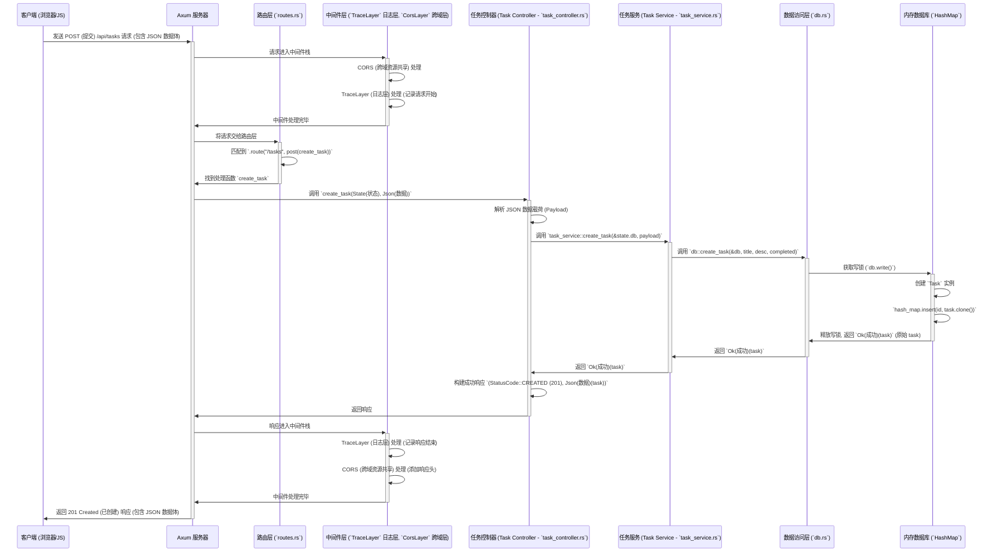

# Axum 分层架构学习项目

## 项目介绍

这是一个为 Rust 初学者设计的 Axum 框架学习项目。本项目实现了一个简单的任务管理系统 (Task Management) API，采用分层架构设计，旨在帮助你理解如何组织大型应用程序。

**项目亮点:**

- ✨ **现代 Rust Web 开发**: 基于 Axum 0.7+ 和 Tokio 构建。
- 📚 **学习友好**: 包含极其详尽的中文注释和模块级文档，解释了每个部分的作用和 Rust 的关键概念。
- 🏗️ **清晰的分层架构**: Controller-Service-DB 模式，易于理解和扩展。
- 📝 **完整的 CRUD API**: 实现了任务的增、删、改、查操作。
- 🌐 **WebSocket 实时通信**: 包含 WebSocket 端点示例，用于实时交互。
- ⚙️ **配置管理**: 从环境变量加载配置。
- 📝 **日志记录**: 集成了 `tracing` 和 `tower_http` 的日志中间件。
- 🛡️ **错误处理**: 统一的 `AppError` 类型和 `IntoResponse` 实现。
- 📄 **静态文件服务**: 使用 `ServeDir` 提供静态资源 (HTML, CSS)。
- ❓ **(可选) HTTP/3 支持**: 包含启动 HTTP/3 服务器的示例代码 (默认注释掉)。

## 技术栈示意图

```mermaid
graph TD
    subgraph "客户端 (Client)"
        C1[浏览器/HTTP 客户端 (Client)] -->|HTTP/1.1, WebSocket| S(Axum 服务器)
        C2[HTTP/3 客户端 (Client)] -->|HTTP/3 (QUIC协议)| S
    end

    subgraph "服务器 (Server - Axum 应用)"
        S --> R(路由层 - `routes.rs`);
        R --> M(中间件层 - `middleware/`)
        M --> CTRL(控制器层 - `controller/`);
        CTRL --> SRV(服务层 - `service/`);
        SRV --> DB(数据访问层 - `db.rs`);
        DB --> Store(内存存储器 (Store) - `HashMap`);
        
        subgraph "支持模块"
            CONF(配置 - `config.rs`) --> S;
            ERR(错误处理 - `error.rs`) --> CTRL;
            ERR --> SRV;
            MOD(模型 - `model/`) --> CTRL;
            MOD --> SRV;
            MOD --> DB;
            LOG(日志 - `tracing` 框架) --> S;
            LOG --> M;
        end
        
        S --> START(启动与初始化 - `startup.rs`);
        START --> R;
        START --> M;
        START --> DB;
        START --> LOG;
        START --> CONF;
        S --> MAIN(入口文件 - `main.rs`);
        MAIN --> START;
    end

    Store -->|数据读写| SRV;
```

## 目录结构说明

下表详细说明了项目源代码 (`src/`) 目录下的文件和文件夹及其作用：

| 路径 (`src/`)        | 类型   | 核心职责                                                     | 关键技术/概念                                      |
| :------------------- | :----- | :----------------------------------------------------------- | :------------------------------------------------- |
| `main.rs`            | 文件   | **应用入口**：启动服务器，初始化异步运行时。                   | `#[tokio::main]`, `axum::serve`, 模块声明 (`mod`)    |
| `startup.rs`         | 文件   | **启动与初始化**：组装应用，配置日志、数据库、路由、中间件。 | `Router`, `ServiceBuilder`, `Layer`, `AppState`    |
| `config.rs`          | 文件   | **配置管理**：定义 `AppConfig`，从环境变量加载配置。       | `struct`, `impl`, `std::env::var`, `.parse()`    |
| `db.rs`              | 文件   | **数据访问层 (DAL)**：封装数据存储操作 (内存 `HashMap`)。    | `Arc<RwLock<HashMap>>`, CRUD 函数, 线程安全         |
| `error.rs`           | 文件   | **错误处理**：定义 `AppError` 枚举，实现 `IntoResponse`。      | `enum`, `impl IntoResponse`, `Result` 类型别名    |
| `routes.rs`          | 文件   | **路由定义**：将 URL 路径和 HTTP 方法映射到控制器函数。        | `Router::new()`, `.route()`, `.nest()`, `.merge()` |
| `app/`               | 目录   | **核心应用逻辑根目录**                                         | -                                                  |
| `app/mod.rs`         | 文件   | 声明 `app` 下的子模块 (`controller`, `service`, etc.)。        | `pub mod`                                          |
| `app/controller/`    | 目录   | **控制器层 (Controller)**：处理 HTTP 请求，调用服务层。      | HTTP 交互, 参数提取, 响应构建                       |
| `app/controller/mod.rs` | 文件 | 声明并导出控制器子模块 (如 `task_controller`)。             | `pub mod`, `pub use`                               |
| `app/controller/task_controller.rs` | 文件 | 实现 `/tasks` 相关 API 的处理函数。                            | `axum::extract`, `Json`, `Path`, `State`, `WebSocket` |
| `app/service/`       | 目录   | **服务层 (Service)**：实现核心业务逻辑，调用数据访问层。     | 业务规则, 数据协调, 事务管理 (如果需要)           |
| `app/service/mod.rs` | 文件   | 声明并导出服务子模块 (如 `task_service`)。                   | `pub mod`, `pub use`                               |
| `app/service/task_service.rs` | 文件 | 实现任务相关的业务操作函数。                                 | `async fn`, 依赖注入 (参数传递 `&Db`)            |
| `app/model/`         | 目录   | **模型层 (Model)**：定义数据结构 (`struct`)。                 | 数据表示, (可选) 验证逻辑                        |
| `app/model/mod.rs`   | 文件   | 声明并导出模型子模块 (如 `task`)。                         | `pub mod`, `pub use`                               |
| `app/model/task.rs`  | 文件   | 定义 `Task` 实体, `CreateTaskPayload`, `UpdateTaskPayload`。 | `struct`, `Uuid`, `serde::{Serialize, Deserialize}` |
| `app/middleware/`    | 目录   | **中间件层 (Middleware)**：提供可重用的横切关注点逻辑。        | 日志, CORS, (可选) 认证/授权等                  |
| `app/middleware/mod.rs` | 文件 | 声明并导出中间件子模块 (如 `logger`)。                     | `pub mod`, `pub use`                               |
| `app/middleware/logger.rs` | 文件 | 提供日志系统设置 (`setup_logger`) 和请求跟踪中间件 (`trace_layer`)。 | `tracing`, `tracing_subscriber`, `TraceLayer`      |
| `static/`            | 目录   | **静态资源**：存放前端 HTML, CSS, JS 等文件。                | -                                                  |
| `static/index.html`  | 文件   | 用于测试 API 和 WebSocket 的简单前端页面。                   | HTML, JavaScript (Fetch API, WebSocket API)      |

## 本地运行流程

```mermaid
flowchart LR
    subgraph "准备阶段"
        A[克隆项目: `git clone ...`] --> B[进入目录: `cd axum-tutorial`];
        B --> C[构建项目 (下载依赖): `cargo build` 命令];
    end

    subgraph "运行阶段"
        C --> D{运行服务器: `cargo run` 命令};
        D -- 成功 --> E[服务器在 http://localhost:3000 (HTTP/1.1) 启动];
        E --> F[打开浏览器访问 http://localhost:3000];
        F --> G[使用前端页面测试 API 或 WebSocket];
        D -- (可选) 启用 HTTP/3 --> H[设置环境变量 `ENABLE_HTTP3=true`];
        H --> I{运行服务器: `cargo run` 命令};
        I --> J[服务器在 https://localhost:3001 (HTTP/3) 启动 (可能需要接受自签名证书)];
    end

    subgraph "测试 API (示例)"
        K[使用 Postman/curl 等工具]
        K --> L[发送 POST (提交) 请求到 /api/tasks 创建任务];
        K --> M[发送 GET (获取) 请求到 /api/tasks 获取任务列表];
    end
```

## 前后端交互流程 (创建任务示例)



## 安装与设置

### 前提条件

- Rust 和 Cargo (建议使用 [rustup](https://rustup.rs/) 安装)
- 基本的命令行知识

### 克隆项目

```bash
git clone https://github.com/yourusername/axum-tutorial.git
cd axum-tutorial
```

### 依赖安装

项目依赖已在 `Cargo.toml` 中定义，运行以下命令安装：

```bash
cargo build
```

## HTTP/3 证书生成步骤

**注意**：HTTP/3 部分是可选的，并且默认**不启用**。如果需要启用，请确保你的系统支持 QUIC，并设置环境变量 `ENABLE_HTTP3=true`。

本项目使用 `rcgen` 库在**运行时自动生成自签名 TLS 证书**，用于本地开发和测试。**无需手动生成证书文件**。

启动时，如果启用了 HTTP/3，你会在控制台看到类似信息，并可能需要在浏览器中接受自签名证书的安全警告。

**警告**: 自签名证书**绝不能**用于生产环境。

## 运行方式

### 启动服务器

```bash
cargo run
```

服务器默认在以下端口启动：
- HTTP/1.1: http://localhost:3000
- (如果启用) HTTP/3: https://localhost:3001

你可以通过设置环境变量来修改端口：
```bash
export HTTP_ADDR="127.0.0.1:8080"
export HTTP3_ADDR="127.0.0.1:8081" # 如果启用 HTTP/3
cargo run
```
或者在 Windows (PowerShell) 上:
```powershell
$env:HTTP_ADDR="127.0.0.1:8080"
$env:HTTP3_ADDR="127.0.0.1:8081" # 如果启用 HTTP/3
cargo run
```

### 使用前端测试页面

打开浏览器访问 http://localhost:3000 即可看到简单的前端测试页面 (`static/index.html`)，可以通过该页面测试 API 和 WebSocket 功能。

## API 使用指南

API 路由都挂载在 `/api` 前缀下。

### 任务管理 API

#### 创建任务
```http
POST /api/tasks
Content-Type: application/json

{
  "title": "完成Rust学习",
  "description": "学习Axum框架并完成项目",
  "completed": false
}
```

#### 获取所有任务
```http
GET /api/tasks
```

#### 获取单个任务
```http
GET /api/tasks/:id
```
**示例**: `GET /api/tasks/xxxxxxxx-xxxx-xxxx-xxxx-xxxxxxxxxxxx`

#### 更新任务
```http
PUT /api/tasks/:id
Content-Type: application/json

{
  "title": "完成Rust学习 (已更新)",
  "description": "已经学习了Axum框架和服务层",
  "completed": true
}
```
**注意**: `title`, `description`, `completed` 都是可选的，只需提供要更新的字段。

#### 删除任务
```http
DELETE /api/tasks/:id
```

### WebSocket

连接端点: `ws://localhost:3000/ws`

- 连接后，服务器会定期发送 Ping 消息。
- 客户端可以发送任何文本消息，服务器会将其广播给所有连接的客户端。

## 学习建议

1.  **理解分层结构**: 先看懂 `README.md` 中的【技术栈示意图】和【目录结构说明】，理解各层职责和依赖关系。
2.  **跟踪请求流程**: 阅读【前后端交互流程 (创建任务示例)】图，了解一个请求是如何从客户端流经服务器各层，最终返回响应的。
3.  **阅读源码与注释**: 从 `main.rs` 和 `startup.rs` 开始，按照代码执行流程阅读。重点关注每个模块的 `.rs` 文件顶部的注释块和 `CONCEPT.md` / `FLOWCHART.md` 文档（位于 `src/app/` 各子目录）。
4.  **运行与调试**: 运行项目 (`cargo run`)，使用浏览器或 Postman 等工具实际调用 API，观察控制台输出的日志，加深理解。
5.  **动手实践**: 尝试修改代码或添加新功能：
    *   为 Task 添加截止日期 (`due_date: Option<DateTime<Utc>>`) 字段，并更新 CRUD 操作。
    *   添加一个新的 API 端点，例如 `/api/tasks/completed` 用于获取所有已完成的任务。
    *   将内存数据库 (`db.rs`) 替换为使用 `sqlx` 和 PostgreSQL/SQLite 的真实数据库（这需要较大的改动）。
    *   为 WebSocket 添加更复杂的功能，如房间或用户认证。

## 许可证

MIT 