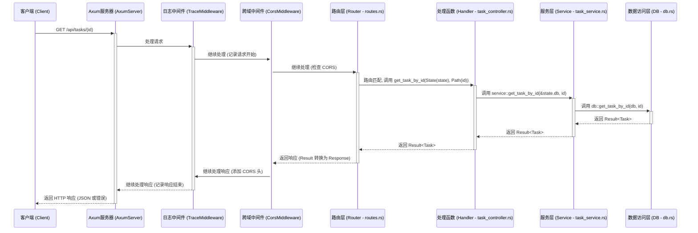
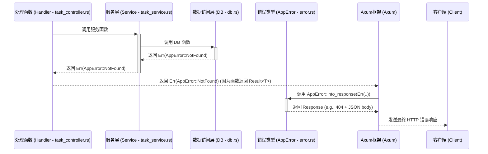

# `src` 模块执行流程图

本文档使用 Mermaid 语法绘制应用程序的启动流程和典型 HTTP 请求处理流程。

## 应用启动流程 (`main` -> `startup` -> `axum::serve`)

```mermaid
graph TD
    A[main 函数开始] --> B{加载配置 (config.rs)};
    B --> C{初始化应用 (startup.rs)};
    C --> D[设置日志 (middleware/logger.rs)];
    D --> E[创建 DB 实例 (db.rs)];
    E --> F[初始化示例数据 (db.rs)];
    F --> G[创建 AppState];
    G --> H[配置中间件 (middleware/logger.rs, tower_http)];
    H --> I{创建路由 (routes.rs)};
    I --> J[创建 API 路由];
    J --> K[创建 WS 路由];
    K --> L[合并路由];
    L --> M[配置静态文件服务];
    M --> N[应用中间件到路由];
    N --> O{返回配置好的 Router}; 
    O --> P[绑定 TCP 地址 (main.rs)];
    P --> Q[启动 Axum 服务器 (axum::serve)];
    Q --> R[服务器开始监听请求];
```

## 典型 HTTP API 请求处理流程 (GET /api/tasks/{id})



## 错误处理流程 (当 Service/DB 返回 Err)

