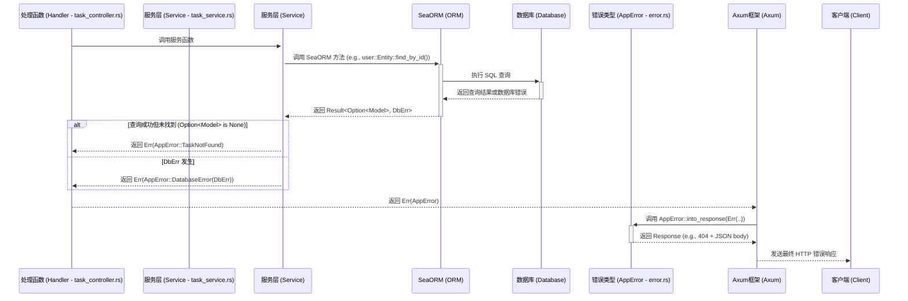

# `src` 模块执行流程图

本文档使用 Mermaid 语法绘制应用程序的启动流程和典型 HTTP 请求处理流程。

## 应用启动流程 (`main` -> `startup` -> `axum::serve`)

```mermaid
graph TD
    A[main 函数开始] --> B{加载配置 (config.rs)};
    B --> C{初始化应用 (startup.rs)};
    C --> D[设置日志 (middleware/logger.rs)];
    D --> E[建立数据库连接 (db.rs - establish_connection)];
    E --> F[运行数据库迁移 (db.rs - run_migrations)];
    F --> G[创建 AppState (包含 DB 连接和配置)];
    G --> H[配置中间件 (middleware/logger.rs, tower_http)];
    H --> I{创建路由 (routes.rs)};
    I --> J[创建 API 路由];
    J --> K[创建 WS 路由];
    K --> L[合并路由];
    L --> M[配置静态文件服务];
    M --> N[应用中间件到路由];
    N --> O{返回配置好的 Router}; 
    O --> P[绑定 TCP 地址 (main.rs)];
    P --> Q[启动 Axum 服务器 (axum::serve)];
    Q --> R[服务器开始监听请求];
```

## 典型 HTTP API 请求处理流程 (GET /api/tasks/{id})

```mermaid
sequenceDiagram
    participant 客户端 (Client)
    participant Axum服务器 (AxumServer)
    participant 日志中间件 (TraceMiddleware)
    participant 跨域中间件 (CorsMiddleware)
    participant JWT提取器 (Claims Extractor - FromRequestParts)
    participant 路由层 (Router - routes.rs)
    participant 处理函数 (Handler - e.g., protected_data_handler)
    participant 服务层 (Service - if applicable)

    客户端 (Client)->>+Axum服务器 (AxumServer): GET /api/protected_data (带 "Authorization: Bearer <token>" 头)
    Axum服务器 (AxumServer)->>+日志中间件 (TraceMiddleware): 处理请求
    日志中间件 (TraceMiddleware)->>+跨域中间件 (CorsMiddleware): 继续处理 (记录请求开始)
    跨域中间件 (CorsMiddleware)->>+路由层 (Router - routes.rs): 继续处理 (检查 CORS)
    路由层 (Router - routes.rs)->>处理函数 (Handler - e.g., protected_data_handler): 路由匹配
    Note right of 路由层 (Router - routes.rs): Axum 准备执行处理器, 发现参数需要 Claims
    路由层 (Router - routes.rs)->>+JWT提取器 (Claims Extractor - FromRequestParts): 调用 Claims::from_request_parts()
    JWT提取器 (Claims Extractor - FromRequestParts)->>JWT提取器 (Claims Extractor - FromRequestParts): 提取Token, 验证签名/有效期 (使用 AppState.config.jwt_secret)
    alt Token 有效
        JWT提取器 (Claims Extractor - FromRequestParts)-->>路由层 (Router - routes.rs): 返回 Ok(Claims)
        路由层 (Router - routes.rs)->>+处理函数 (Handler - e.g., protected_data_handler): 注入 Claims, 调用处理器
        处理函数 (Handler - e.g., protected_data_handler)-->>处理函数 (Handler - e.g., protected_data_handler): 执行业务逻辑 (可能调用服务层)
        处理函数 (Handler - e.g., protected_data_handler)-->>-路由层 (Router - routes.rs): 返回 Response
    else Token 无效/缺失
        JWT提取器 (Claims Extractor - FromRequestParts)-->>路由层 (Router - routes.rs): 返回 Err(AppError::Unauthorized)
        Note right of JWT提取器 (Claims Extractor - FromRequestParts): 请求被拒绝, 处理器不执行
        路由层 (Router - routes.rs)-->>跨域中间件 (CorsMiddleware): 返回 AppError 转换的 Response (401)
    end
    路由层 (Router - routes.rs)-->>-跨域中间件 (CorsMiddleware): 返回响应
    跨域中间件 (CorsMiddleware)->>日志中间件 (TraceMiddleware): 继续处理响应 (添加 CORS 头)
    日志中间件 (TraceMiddleware)-->>-Axum服务器 (AxumServer): 继续处理响应 (记录响应结束)
    Axum服务器 (AxumServer)-->>-客户端 (Client): 返回 HTTP 响应 (JSON 数据或错误)
```

## 错误处理流程 (当 Service/DB 返回 Err)

```mermaid
sequenceDiagram
    participant 处理函数 (Handler - task_controller.rs)
    participant 服务层 (Service - task_service.rs)
    participant 服务层 (Service)
    participant SeaORM (ORM)
    participant 数据库 (Database)
    participant 错误类型 (AppError - error.rs)
    participant Axum框架 (Axum)
    participant 客户端 (Client)

    处理函数 (Handler - task_controller.rs)->>+服务层 (Service): 调用服务函数
    服务层 (Service)->>+SeaORM (ORM): 调用 SeaORM 方法 (e.g., user::Entity::find_by_id())
    SeaORM (ORM)->>+数据库 (Database): 执行 SQL 查询
    数据库 (Database)-->>-SeaORM (ORM): 返回查询结果或数据库错误
    SeaORM (ORM)-->>-服务层 (Service): 返回 Result<Option<Model>, DbErr>
    alt 查询成功但未找到 (Option<Model> is None)
        服务层 (Service)-->>处理函数 (Handler - task_controller.rs): 返回 Err(AppError::TaskNotFound)
    else DbErr 发生
        服务层 (Service)-->>处理函数 (Handler - task_controller.rs): 返回 Err(AppError::DatabaseError(DbErr))
    end
    处理函数 (Handler - task_controller.rs)-->>Axum框架 (Axum): 返回 Err(AppError)
    Axum框架 (Axum)->>+错误类型 (AppError - error.rs): 调用 AppError::into_response(Err(..))
    错误类型 (AppError - error.rs)-->>-Axum框架 (Axum): 返回 Response (e.g., 404 + JSON body)
    Axum框架 (Axum)-->>客户端 (Client): 发送最终 HTTP 错误响应
``` 