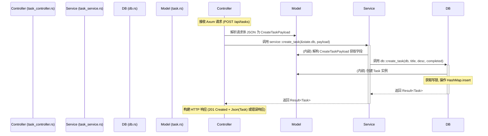
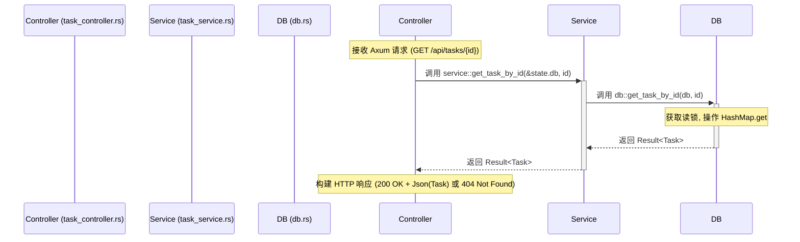

# `src/app` 模块执行流程图

本文档使用 Mermaid 语法绘制 `app` 模块内部，特别是 Controller, Service, DB 层之间的典型交互流程。

## Controller -> Service -> DB 交互流程 (以创建任务为例)

## Controller -> Service -> DB 交互流程 (以获取任务为例)

**注意**: 上述流程图简化了错误处理路径，错误 (`Err(AppError)`) 通常会直接从 DB 或 Service 传递回 Controller，然后由 Axum 通过 `IntoResponse` 处理。 